# Tasqra 화면정의서

**프로젝트** Tasqra — 문서 기반 프로젝트 실행 관리 서비스
**작성일** 2026-09-08
**기준 Tasqra** `ba09d52ef9d2200c48300dd0a97b890d402691b5`
**구성** 표지 · 화면흐름도 · 화면별 구성

---

## 화면흐름도

---

## SCR-001 서비스 랜딩

**경로** `/` · **접근** 공개

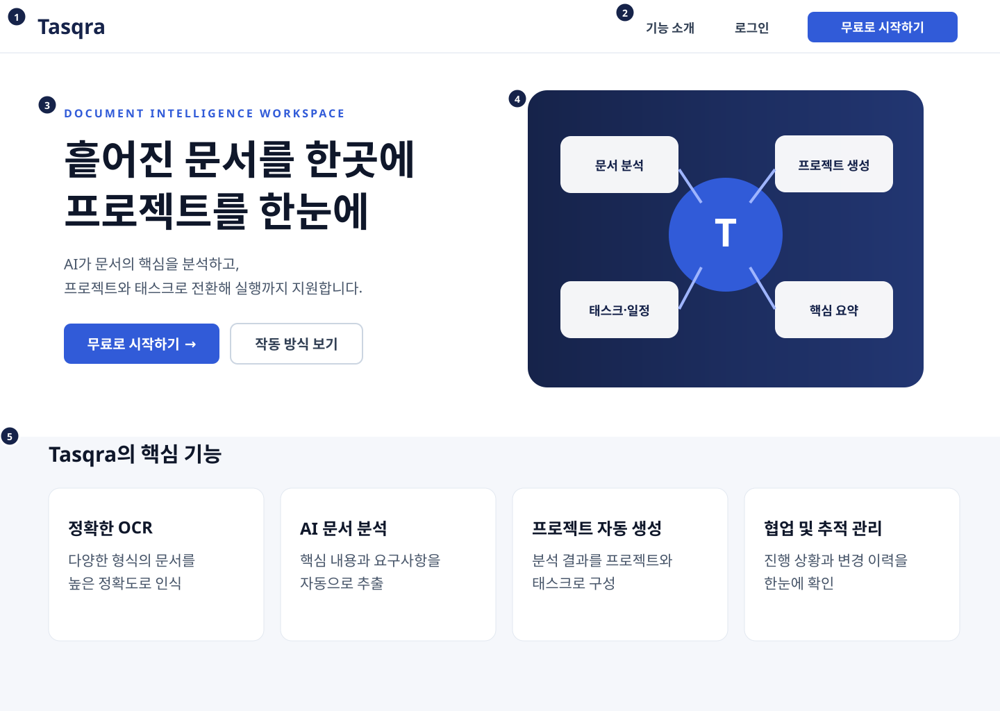

| 번호 | 구성요소 | 역할 |
|---:|---|---|
| 1 | Tasqra 헤더 | 서비스명과 공통 상단 영역을 표시한다. |
| 2 | 시작 메뉴 | 기능 소개, 로그인, 무료 시작 진입을 제공한다. |
| 3 | 서비스 소개 | Tasqra의 핵심 가치와 시작 동작을 안내한다. |
| 4 | 연결 흐름 이미지 | 문서 분석에서 프로젝트 실행까지의 관계를 보여준다. |
| 5 | 핵심 기능 카드 | OCR, AI 분석, 프로젝트 생성, 협업 기능을 소개한다. |

---

## SCR-002 로그인

**경로** `/login` · **접근** 공개

| 번호 | 구성요소 | 역할 |
|---:|---|---|
| 1 | Tasqra 로고 | 서비스 랜딩으로 이동한다. |
| 2 | 브랜드 소개 | 문서부터 실행까지 이어지는 서비스 특징을 설명한다. |
| 3 | 로그인 안내 | 로그인 목적과 계정 사용을 안내한다. |
| 4 | 계정 입력 | 아이디와 비밀번호를 입력받는다. |
| 5 | 로그인 버튼 | 인증 후 내 프로젝트 화면으로 이동한다. |
| 6 | 회원가입 이동 | 새 계정 만들기 화면으로 이동한다. |

---

## SCR-003 회원가입

**경로** `/signup` · **접근** 공개

| 번호 | 구성요소 | 역할 |
|---:|---|---|
| 1 | Tasqra 로고 | 서비스 랜딩으로 이동한다. |
| 2 | 브랜드 소개 | Tasqra의 문서·프로젝트 연결 방식을 설명한다. |
| 3 | 회원가입 안내 | 새 계정 생성 목적을 안내한다. |
| 4 | 계정 정보 입력 | 표시 이름, 아이디, 이메일, 비밀번호를 입력받는다. |
| 5 | 계정 만들기 | 입력한 정보로 계정을 생성한다. |
| 6 | 로그인 이동 | 기존 계정 로그인 화면으로 이동한다. |

---

## SCR-004 내 프로젝트 목록·프로젝트 생성

**경로** `/projects` · **접근** OWNER · EDITOR · VIEWER

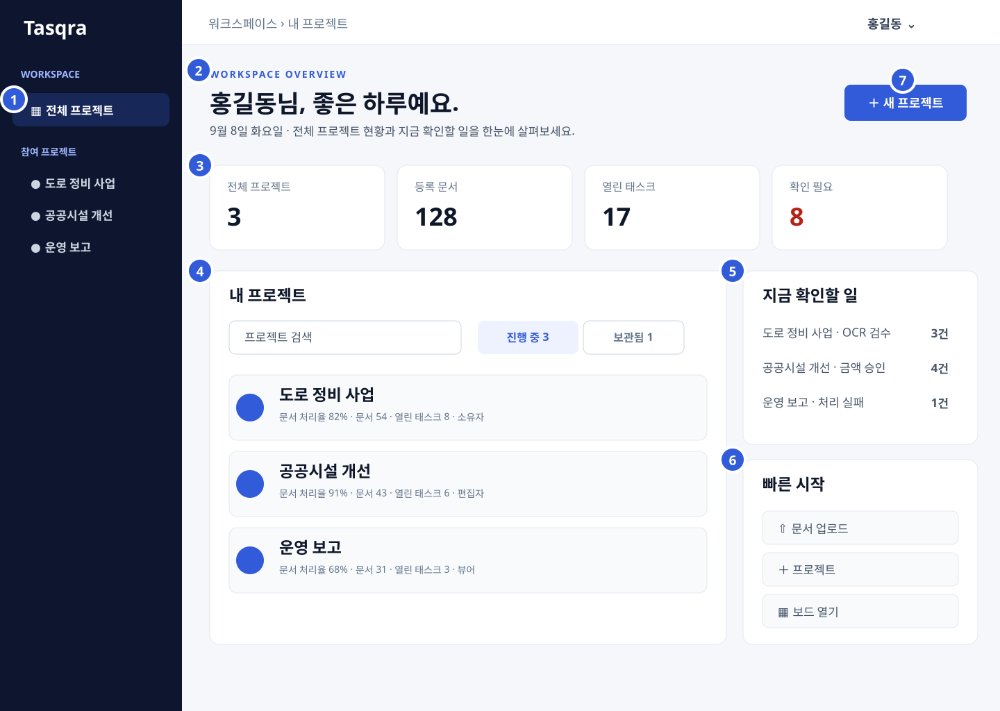

| 번호 | 구성요소 | 역할 |
|---:|---|---|
| 1 | 프로젝트 사이드바 | 전체 프로젝트와 참여 프로젝트를 전환한다. |
| 2 | 화면 제목 | 사용자 인사와 전체 프로젝트 현황을 안내한다. |
| 3 | 전체 요약 카드 | 프로젝트, 문서, 태스크, 확인 필요 건수를 표시한다. |
| 4 | 내 프로젝트 목록 | 검색과 상태 필터로 프로젝트를 찾고 작업공간으로 이동한다. |
| 5 | 지금 확인할 일 | OCR 검수, 금액 승인, 처리 실패 항목으로 이동한다. |
| 6 | 빠른 시작 | 문서 업로드, 프로젝트 생성, 보드로 빠르게 이동한다. |
| 7 | 새 프로젝트 | 프로젝트명, 설명, 초대 팀원을 입력하는 생성 창을 연다. |

---

## SCR-005 프로젝트 대시보드

**경로** `/projects/:projectId/dashboard` · **접근** OWNER · EDITOR · VIEWER

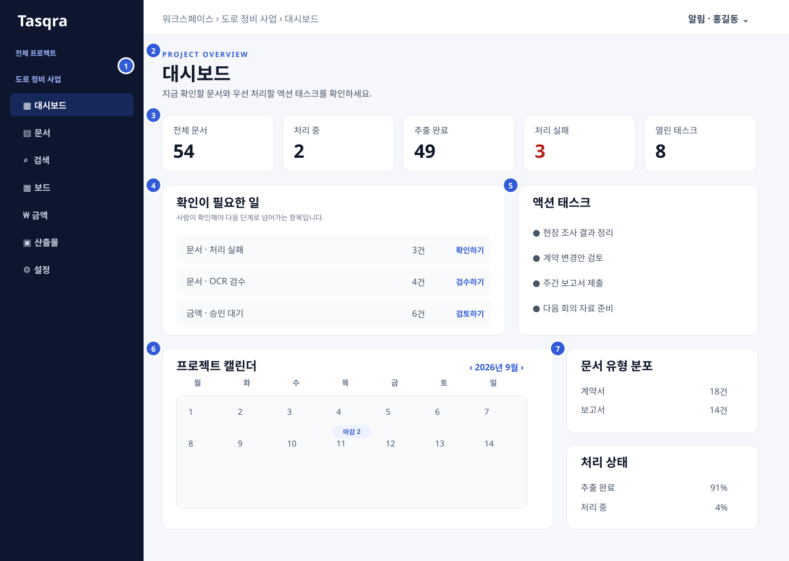

| 번호 | 구성요소 | 역할 |
|---:|---|---|
| 1 | 프로젝트 메뉴 | 대시보드와 프로젝트 기능 탭을 전환한다. |
| 2 | 화면 제목 | 현재 프로젝트 대시보드의 목적을 표시한다. |
| 3 | 핵심 현황 카드 | 전체 문서, 처리 상태, 열린 태스크 수를 표시한다. |
| 4 | 확인이 필요한 일 | 처리 실패, OCR 검수, 금액 승인 항목을 연결한다. |
| 5 | 액션 태스크 | 우선 확인할 열린 태스크를 표시한다. |
| 6 | 프로젝트 캘린더 | 태스크 마감과 승인 일정을 날짜별로 표시한다. |
| 7 | 분포·처리 현황 | 문서 유형과 처리 단계별 비율을 표시한다. |

---

## SCR-006 문서 목록·업로드

**경로** `/projects/:projectId/documents` · **접근** OWNER · EDITOR · VIEWER

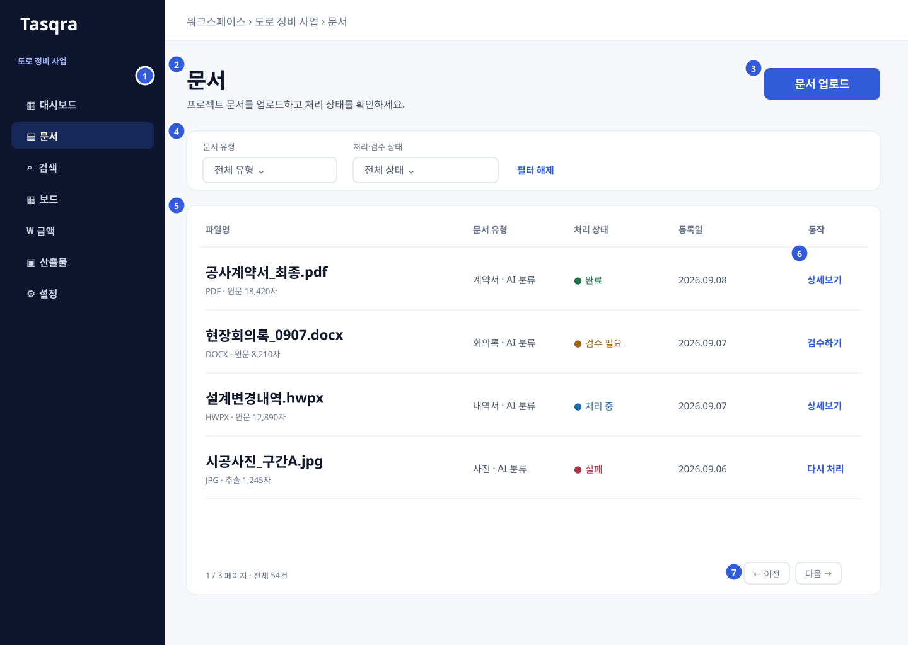

| 번호 | 구성요소 | 역할 |
|---:|---|---|
| 1 | 프로젝트 메뉴 | 문서 탭의 현재 위치와 다른 기능 탭을 제공한다. |
| 2 | 화면 제목 | 프로젝트 문서 관리 목적을 표시한다. |
| 3 | 문서 업로드 | 파일 선택, 유형, 추출 방식과 업로드 큐를 연다. |
| 4 | 문서 필터 | 문서 유형과 처리·검수 상태로 목록을 좁힌다. |
| 5 | 문서 목록 | 파일명, 유형, 처리 상태, 등록일을 표시한다. |
| 6 | 문서별 동작 | 상세보기, 검수, 다시 처리를 실행한다. |
| 7 | 페이지 이동 | 전체 건수와 현재 페이지를 표시하고 목록을 이동한다. |

---

## SCR-007 문서 상세·원문

**경로** `/projects/:projectId/documents/:documentId` · **접근** OWNER · EDITOR · VIEWER

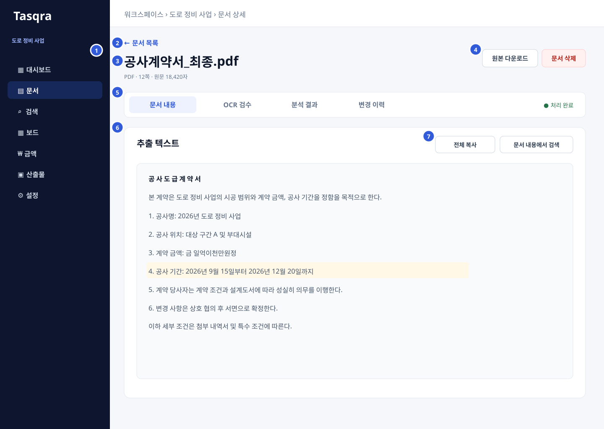

| 번호 | 구성요소 | 역할 |
|---:|---|---|
| 1 | 프로젝트 메뉴 | 문서 기능의 현재 위치를 유지한다. |
| 2 | 문서 목록 이동 | 기존 문서 목록으로 돌아간다. |
| 3 | 문서 정보 | 파일명, 형식, 페이지, 문자 수와 상태를 표시한다. |
| 4 | 문서 동작 | 원본 다운로드와 문서 삭제를 제공한다. |
| 5 | 상세 탭 | 문서 내용, OCR 검수, 분석 결과, 변경 이력을 전환한다. |
| 6 | 추출 텍스트 | 문서에서 추출한 전체 본문을 표시한다. |
| 7 | 본문 도구 | 전체 복사와 문서 내용 검색을 제공한다. |

---

## SCR-008 문서 분석 결과·검토

**경로** `/projects/:projectId/documents/:documentId?tab=analysis` · **접근** OWNER · EDITOR · VIEWER

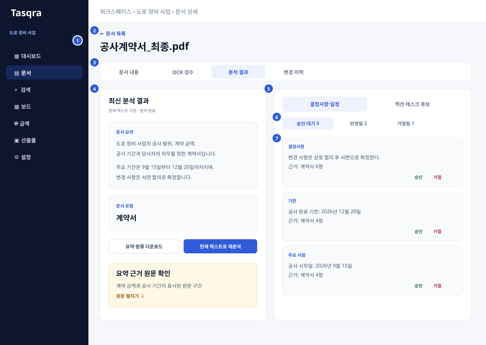

| 번호 | 구성요소 | 역할 |
|---:|---|---|
| 1 | 프로젝트 메뉴 | 문서 기능의 현재 위치를 유지한다. |
| 2 | 문서 정보 | 분석 대상 문서와 목록 이동을 표시한다. |
| 3 | 상세 탭 | 분석 결과 탭과 다른 문서 상세 탭을 전환한다. |
| 4 | 최신 분석 결과 | 문서 요약, 문서 유형, 근거와 재분석 동작을 제공한다. |
| 5 | 검토 영역 | 결정사항·일정과 액션 태스크 후보를 표시한다. |
| 6 | 검토 종류 탭 | 결정사항·일정과 액션 태스크 후보를 전환한다. |
| 7 | 검토 상태 탭 | 승인 대기, 반영됨, 거절됨 항목을 구분한다. |

---

## SCR-009 OCR 검수

**경로** `/projects/:projectId/documents/:documentId/review` · **접근** OWNER · EDITOR · VIEWER

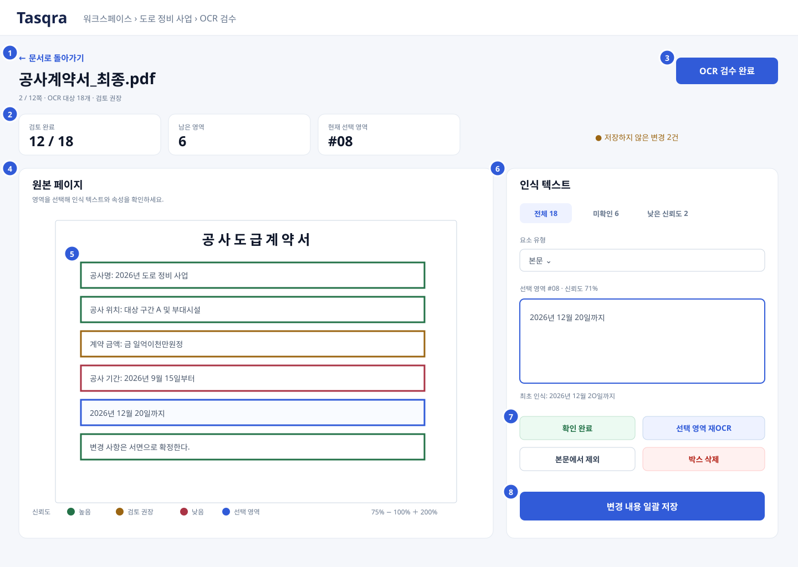

| 번호 | 구성요소 | 역할 |
|---:|---|---|
| 1 | 문서 복귀 | 문서 상세 화면으로 돌아간다. |
| 2 | 검수 진행 현황 | 검토 완료, 남은 영역, 현재 선택 영역을 표시한다. |
| 3 | 검수 완료 | 저장한 OCR 결과를 최종 본문에 반영한다. |
| 4 | 원본 페이지 | 원본 이미지와 페이지 이동·확대 기능을 제공한다. |
| 5 | OCR 박스 | 신뢰도와 선택 상태에 따라 문서 영역을 표시한다. |
| 6 | 인식 텍스트 편집 | 선택 영역의 유형과 인식 텍스트를 확인·수정한다. |
| 7 | 영역 동작 | 확인, 재OCR, 분석 제외, 박스 삭제를 실행한다. |
| 8 | 일괄 저장 | 여러 영역의 변경 내용을 한 번에 저장한다. |

---

## SCR-010 통합 검색

**경로** `/projects/:projectId/search` · **접근** OWNER · EDITOR · VIEWER

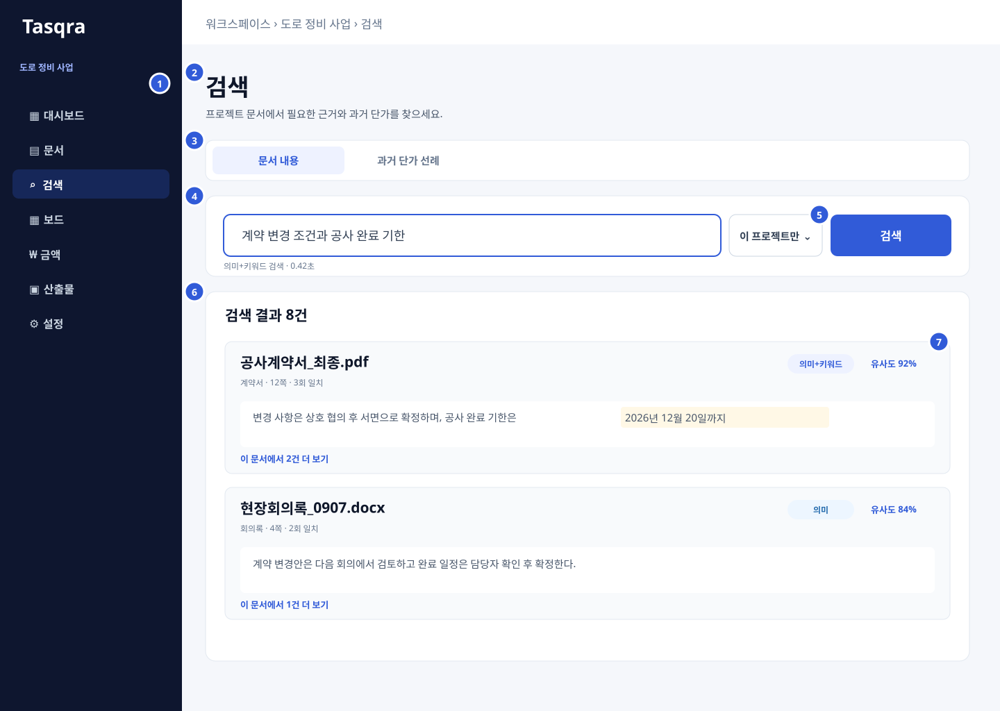

| 번호 | 구성요소 | 역할 |
|---:|---|---|
| 1 | 프로젝트 메뉴 | 검색 탭의 현재 위치와 다른 기능 탭을 제공한다. |
| 2 | 화면 제목 | 프로젝트 문서 검색 목적을 표시한다. |
| 3 | 검색 모드 | 문서 내용과 과거 단가 선례 검색을 전환한다. |
| 4 | 검색어 입력 | 찾을 문장이나 키워드를 입력받는다. |
| 5 | 범위·검색 실행 | 현재 프로젝트 또는 전체 참여 프로젝트 범위를 선택해 검색한다. |
| 6 | 검색 결과 | 문서별 스니펫과 원문 일치 구간을 표시한다. |
| 7 | 결과 정보 | 검색 방식, 유사도, 일치 횟수를 표시한다. |

---

## SCR-011 문서 기반 질의응답

**경로** 프로젝트 화면 공통 우측 패널 · **접근** OWNER · EDITOR · VIEWER

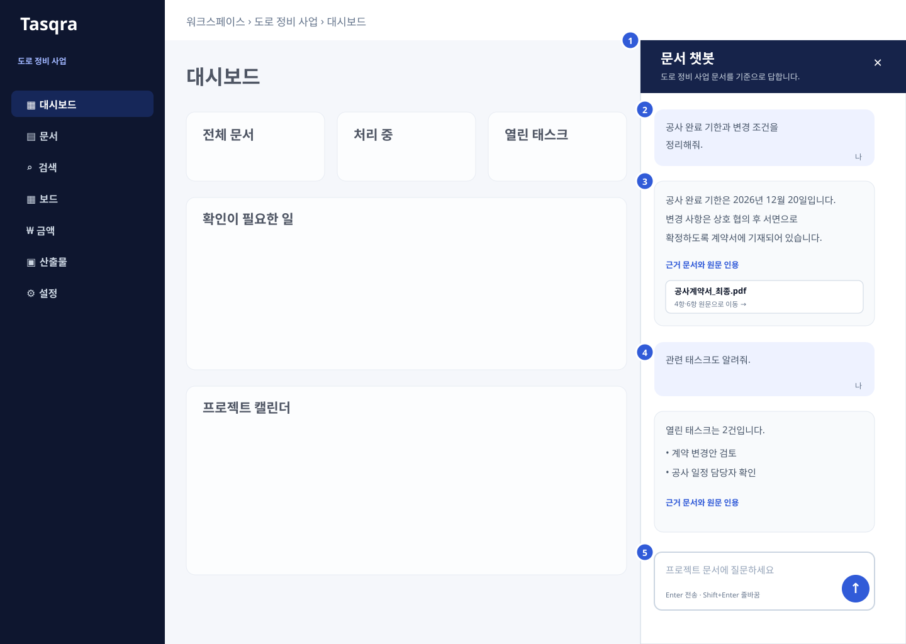

| 번호 | 구성요소 | 역할 |
|---:|---|---|
| 1 | 챗봇 제목 | 현재 프로젝트 문서를 기준으로 답변함을 표시한다. |
| 2 | 사용자 질문 | 사용자가 입력한 질문을 대화 순서대로 표시한다. |
| 3 | 답변·근거 | 문서 기반 답변과 사용한 원문 근거를 표시한다. |
| 4 | 대화 이력 | 이어지는 질문과 답변을 같은 프로젝트 안에서 유지한다. |
| 5 | 질문 입력 | 질문 작성, 줄바꿈, 전송 동작을 제공한다. |

---

## SCR-012 태스크 보드

**경로** `/projects/:projectId/board` · **접근** OWNER · EDITOR · VIEWER

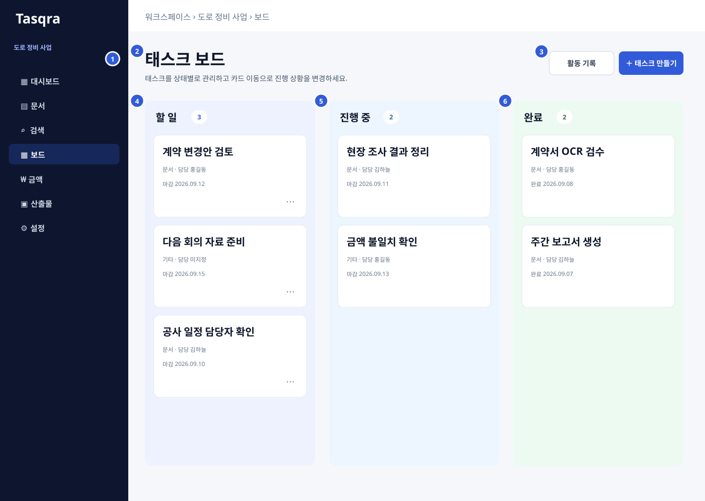

| 번호 | 구성요소 | 역할 |
|---:|---|---|
| 1 | 프로젝트 메뉴 | 보드 탭의 현재 위치와 다른 기능 탭을 제공한다. |
| 2 | 화면 제목 | 태스크 상태 관리 목적을 표시한다. |
| 3 | 보드 동작 | 활동 기록을 열고 새 태스크를 만든다. |
| 4 | 할 일 열 | 시작 전 태스크를 표시한다. |
| 5 | 진행 중 열 | 현재 수행 중인 태스크를 표시한다. |
| 6 | 완료 열 | 완료한 태스크를 표시한다. |

---

## SCR-013 금액 현황·금액 검토

**경로** `/projects/:projectId/amounts` · **접근** OWNER · EDITOR

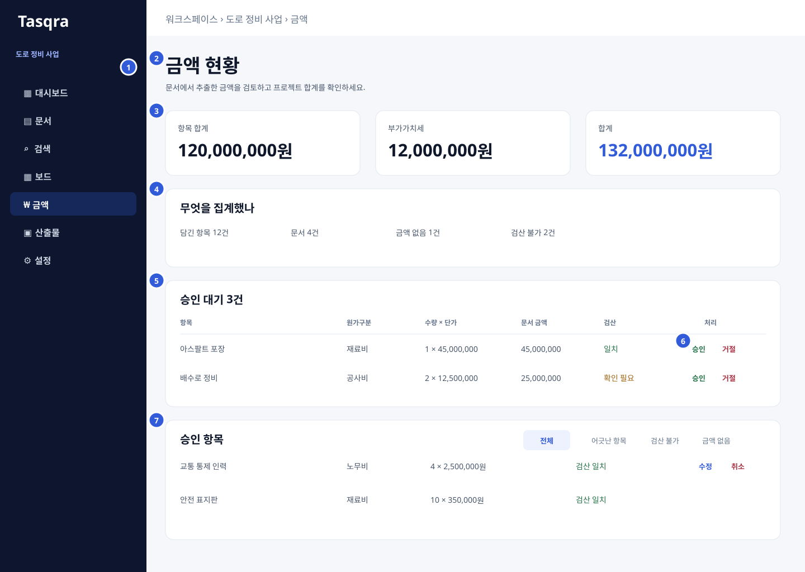

| 번호 | 구성요소 | 역할 |
|---:|---|---|
| 1 | 프로젝트 메뉴 | 금액 탭의 현재 위치와 다른 기능 탭을 제공한다. |
| 2 | 화면 제목 | 추출 금액의 검토와 집계 목적을 표시한다. |
| 3 | 금액 요약 | 항목 합계, 부가가치세, 전체 합계를 표시한다. |
| 4 | 집계 범위 | 집계된 항목·문서와 검산 상태를 표시한다. |
| 5 | 승인 대기 | 문서에서 새로 추출한 금액 항목을 표시한다. |
| 6 | 검토 동작 | 승인과 거절로 금액 항목의 반영 여부를 정한다. |
| 7 | 승인 항목 | 반영된 금액을 필터링하고 수정·승인 취소한다. |

---

## SCR-014 산출물 미리보기·생성·이력

**경로** `/projects/:projectId/deliverables` · **접근** OWNER · EDITOR · VIEWER

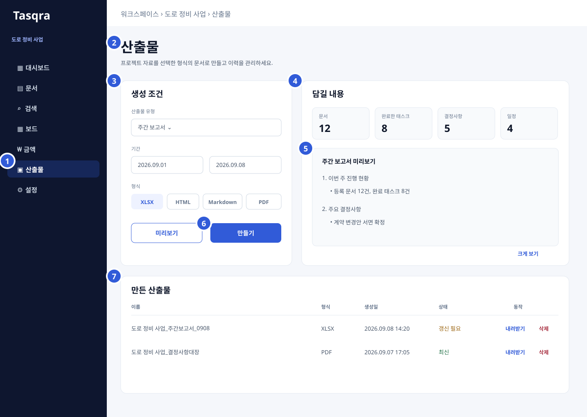

| 번호 | 구성요소 | 역할 |
|---:|---|---|
| 1 | 프로젝트 메뉴 | 산출물 탭의 현재 위치와 다른 기능 탭을 제공한다. |
| 2 | 화면 제목 | 프로젝트 산출물 생성과 관리 목적을 표시한다. |
| 3 | 생성 조건 | 산출물 유형, 기간, 파일 형식을 선택한다. |
| 4 | 담길 내용 | 생성 문서에 포함할 문서·태스크·결정·일정 건수를 표시한다. |
| 5 | 본문 미리보기 | 선택 조건으로 구성될 산출물 내용을 표시한다. |
| 6 | 미리보기·만들기 | 조건을 확인하고 산출물 파일을 생성한다. |
| 7 | 생성 이력 | 기존 산출물의 상태를 확인하고 다운로드·삭제한다. |

---

## SCR-015 프로젝트 멤버·설정

**경로** `/projects/:projectId/settings` · **접근** OWNER · EDITOR · VIEWER

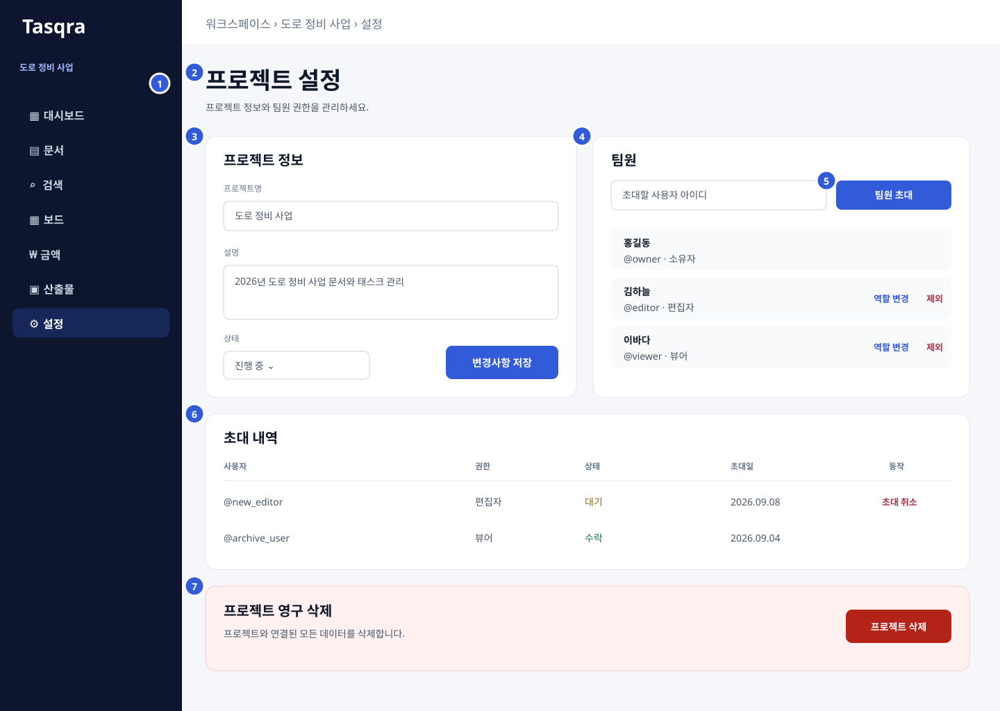

| 번호 | 구성요소 | 역할 |
|---:|---|---|
| 1 | 프로젝트 메뉴 | 설정 탭의 현재 위치와 다른 기능 탭을 제공한다. |
| 2 | 화면 제목 | 프로젝트 정보와 팀원 관리 목적을 표시한다. |
| 3 | 프로젝트 정보 | 프로젝트명, 설명, 상태를 조회·수정한다. |
| 4 | 팀원 목록 | 참여 팀원과 역할을 표시하고 역할 변경·제외를 제공한다. |
| 5 | 팀원 초대 | 사용자 아이디와 권한으로 새 팀원을 초대한다. |
| 6 | 초대 내역 | 보낸 초대의 권한과 상태를 확인하고 취소한다. |
| 7 | 프로젝트 삭제 | 프로젝트를 영구 삭제하는 동작을 제공한다. |

---

## SCR-016 페이지 없음

**경로** 정의되지 않은 경로 · **접근** 공개

| 번호 | 구성요소 | 역할 |
|---:|---|---|
| 1 | 공통 헤더 | 서비스명과 정상 화면 이동 메뉴를 제공한다. |
| 2 | 오류 안내 | 요청한 페이지가 존재하지 않음을 알린다. |
| 3 | 복귀 동작 | 내 프로젝트 또는 서비스 홈으로 이동한다. |
