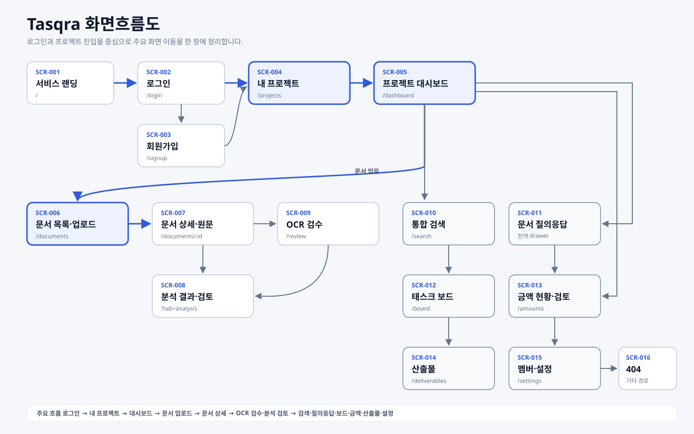
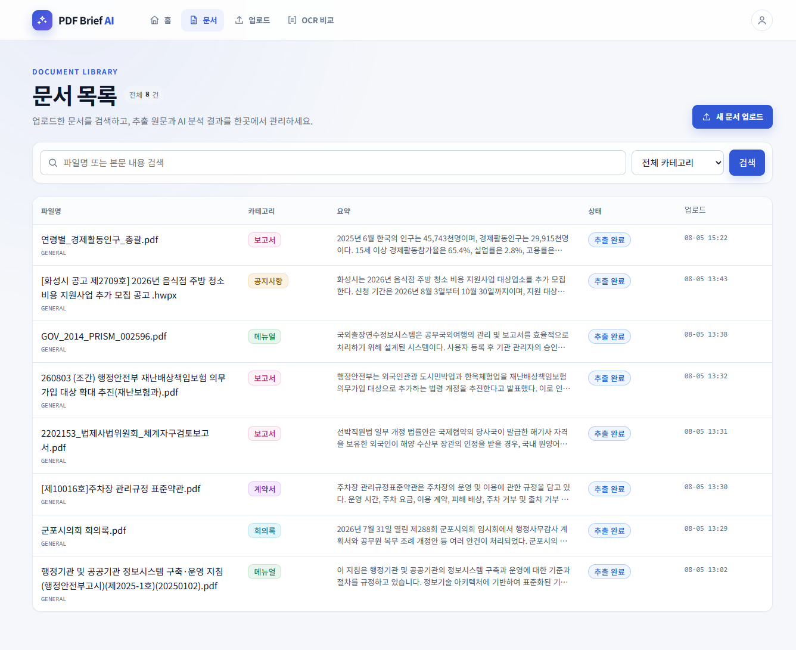
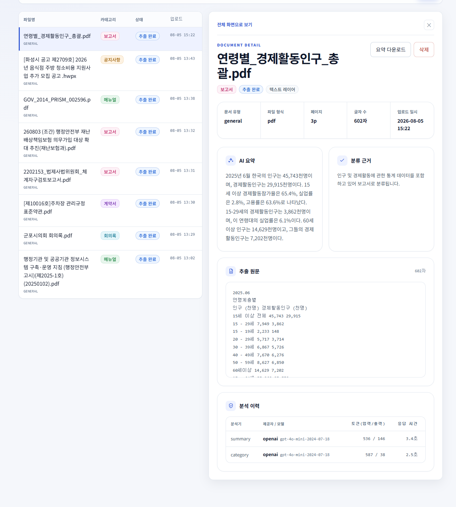
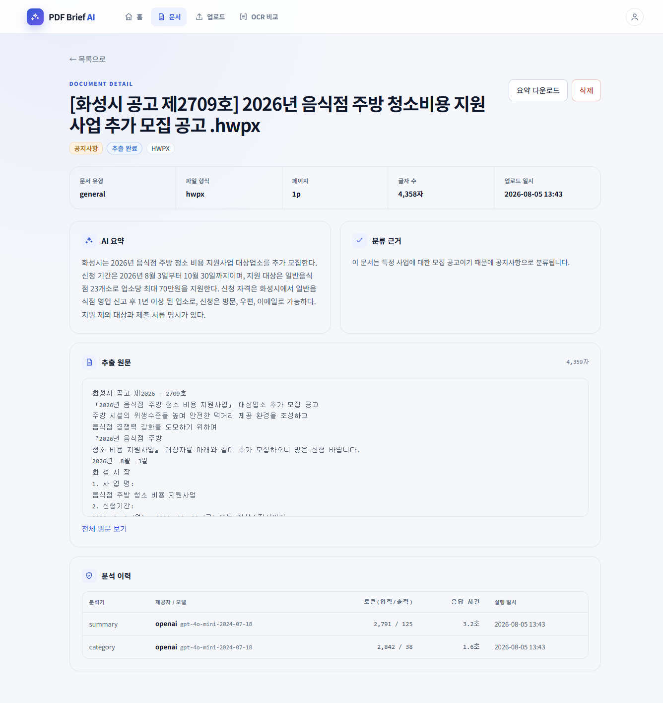
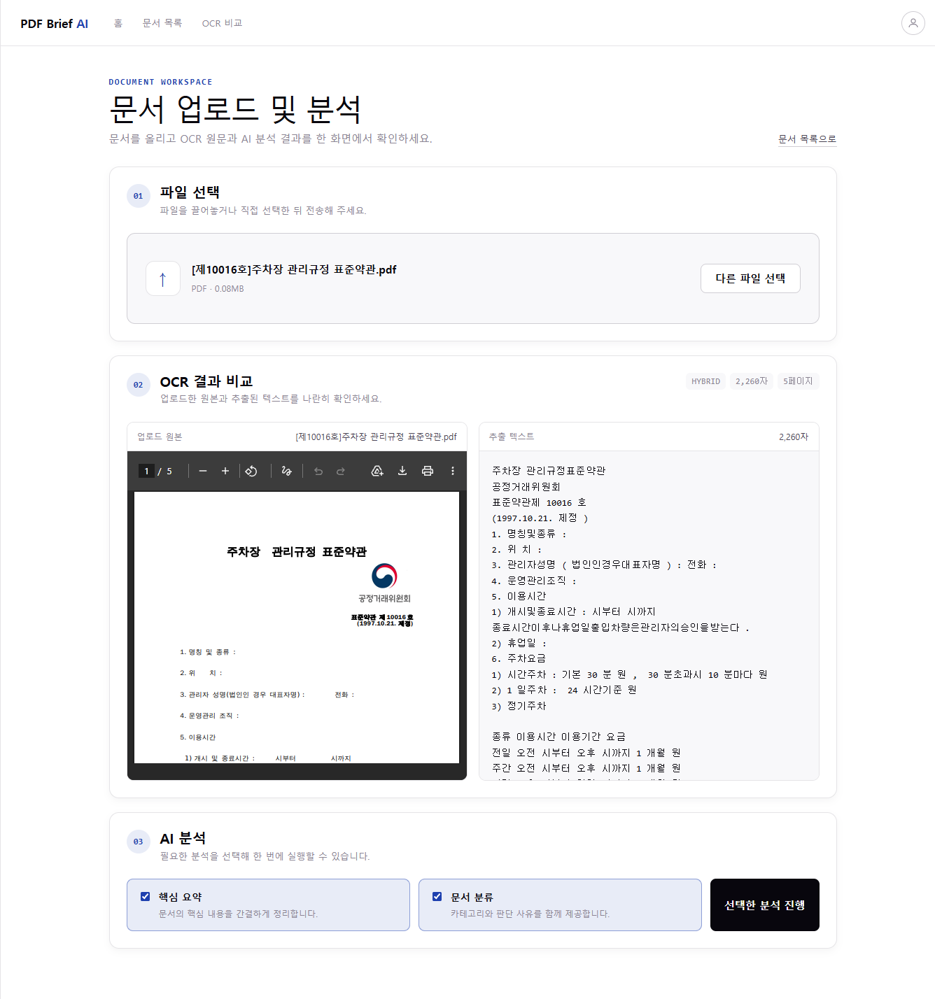
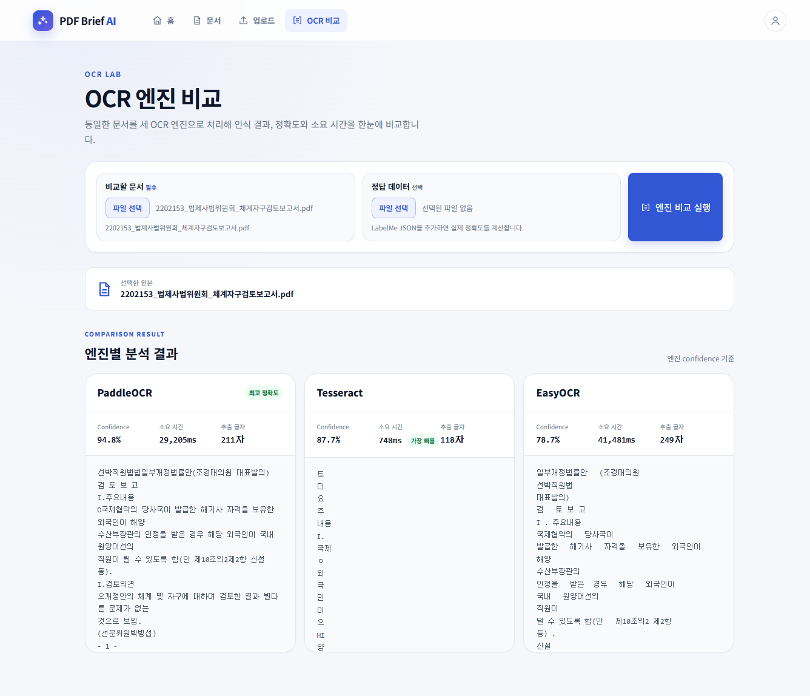
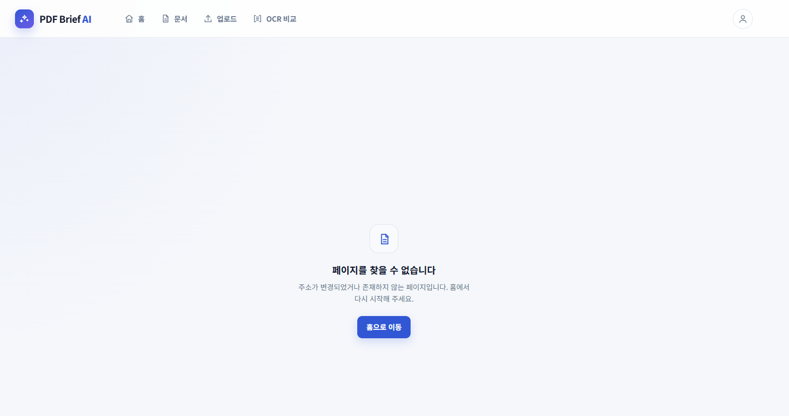

# 화면 정의서

**프로젝트** PDF Brief AI — 문서 요약·분류 웹 서비스
**작성** 김보현 | **작성일** 2026-08-05 | **기준 커밋** `main` (코드 프리즈 시점)
**대상** 구현 완료된 6개 화면

---

## 0. 문서 개요

### 0.1 화면 목록

| 화면 ID | 화면명 | 경로(URL) | 담당 | 접근 권한 |
|---|---|---|---|---|
| **HOME** | 홈 (서비스 소개) | `/` | 박세현 | 공개 |
| **LIST** | 문서 목록 + 상세 패널 | `/documents` | 김보현 | 공개 |
| **DTL** | 문서 상세 (전체 화면) | `/documents/:id` | 김보현 | 공개 |
| **UPL** | 문서 업로드 및 분석 | `/upload` | 최재정 | 공개 |
| **CMP** | OCR 엔진 비교 | `/ocr-compare` | 박세현 | 공개 |
| **NF** | 페이지 없음 (404) | 정의되지 않은 모든 경로 | 박세현 | 공개 |

> 인증 기능은 미니프로젝트 범위에서 제외되었으므로 모든 화면이 공개다.
> 도입 시의 보호 범위는 **부록 D**에 정의한다.

### 0.2 공통 레이아웃

모든 화면은 `MainLayout`을 공유한다. 헤더는 화면마다 다시 그리지 않는다.




| 요소 ID | 유형 | 명칭 | 동작 |
|---|---|---|---|
| CMN-01 | 링크(로고) | PDF Brief AI | `/` 로 이동 |
| CMN-02 | 네비게이션 | 홈 | `/` 로 이동. 현재 화면이면 강조 |
| CMN-03 | 네비게이션 | 문서 | `/documents` 로 이동. 현재 화면이면 강조 |
| CMN-04 | 네비게이션 | 업로드 | `/upload` 로 이동. 현재 화면이면 강조 |
| CMN-05 | 네비게이션 | OCR 비교 | `/ocr-compare` 로 이동. 현재 화면이면 강조 |
| CMN-06 | 버튼(아이콘) | 사용자 | **동작 없음 — 인증 기능 삽입 지점** (부록 D) |

> **업로드 진입점이 두 곳이다.** 헤더 `업로드` 메뉴와 문서 목록의 `새 문서 업로드` 버튼이
> 같은 화면으로 연결된다. 결정사항 19에서 "헤더에서 제거하고 목록 버튼으로 통일"로 정했으나,
> 08-05 프론트엔드 UI 개편에서 헤더 메뉴가 다시 추가되어 현재는 두 경로가 함께 존재한다.
> 기능상 충돌은 없으며, 진입점 단일화 여부는 본프로젝트에서 재검토한다.

- 네비게이션 항목은 아이콘과 이름을 함께 표시한다.
- 현재 화면에 해당하는 항목은 배경 강조로 구분한다.

- 컨테이너 최대 폭 **1440px**, 좌우 여백 **28px** (`--c-page-x`)
- 색상은 라이트 모드 고정 (다크모드 미지원 — 결정사항 14)
- 강조색 `#1e40af`

---

## 1. HOME — 홈 (서비스 소개)

### 1.1 개요

| 항목 | 내용 |
|---|---|
| 목적 | 서비스가 무엇을 하는지, 각 기능을 어떻게 쓰는지 안내한다 |
| URL | `/` |
| 연동 API | 없음 (정적 화면) |

### 화면 캡처


> 캡처 위의 번호는 아래 **UI 요소** 표의 요소 ID 뒷자리와 대응한다 (예: 캡처의 `01` = `HOME-01`). 해당 요소: HOME-01 기능 메뉴 · HOME-02 설명 영역

### 1.2 영역 구성

```
┌─────────────┬──────────────────────────────────┐
│ HOME-01     │ HOME-02                          │
│ 기능 메뉴    │ 설명 표시 영역                     │
│ (3개)       │ (선택된 기능 또는 기본 소개)         │
└─────────────┴──────────────────────────────────┘
```

### 1.3 UI 요소

| 요소 ID | 유형 | 명칭 | 동작 |
|---|---|---|---|
| HOME-01 | 메뉴 목록 | 문서업로드 / AI분석 / 검색·다운로드 | **마우스 올림(hover)** 시 해당 기능 설명으로 전환, 강조 표시 |
| HOME-02 | 텍스트 영역 | 설명 | 선택된 메뉴의 설명을 문단 단위로 표시. 미선택 시 `서비스 소개` 기본 문구 |

- 메뉴 영역에서 마우스가 벗어나면(`onMouseLeave`) 기본 소개로 복귀한다.
- 클릭이 아니라 hover로 동작하므로 **화면 이동이 발생하지 않는다.**

### 1.4 상태별 표시

| 상태 | 표시 |
|---|---|
| 기본 | 제목 `서비스 소개` + 서비스 전체 설명 3문단 |
| 메뉴 hover | 제목 = 메뉴명, 본문 = 해당 기능 사용 방법 |

### 1.5 비고

- 기능이 추가될 때 **설명서 역할**을 하도록 설계된 영역이다. 메뉴 배열에 항목을 추가하면 화면이 확장된다.
- 이 영역의 문구는 산출물 `운영 메뉴얼`의 "사용 방법" 절과 내용을 공유한다.

---

## 2. LIST — 문서 목록 + 상세 패널

### 2.1 개요

| 항목 | 내용 |
|---|---|
| 목적 | 업로드된 문서를 검색·조회하고, 선택한 문서의 상세를 같은 화면에서 확인한다 |
| URL | `/documents` |
| URL 파라미터 | `q`(검색어) · `category`(카테고리) · `page`(페이지) · `selected`(선택 문서 ID) |

> **조회 조건과 선택 문서를 모두 URL에 보관한다.** 새로고침·뒤로가기·주소 공유 시 같은 화면이 재현된다.

### 화면 캡처



> 캡처 위의 번호는 아래 **UI 요소** 표의 요소 ID 뒷자리와 대응한다 (예: 캡처의 `01` = `LST-01`). 해당 요소: LST-01~LST-20

### 2.2 영역 구성

**패널 닫힘 (기본)**

```
┌──────────────────────────────────────────────────┐
│ LST-01 제목 · 건수                LST-03 업로드 버튼 │
├──────────────────────────────────────────────────┤
│ LST-04 검색어  LST-05 카테고리  LST-06 검색  LST-07 초기화│
├──────────────────────────────────────────────────┤
│ LST-10 문서 표 (5열)                              │
├──────────────────────────────────────────────────┤
│ LST-20 페이징                                     │
└──────────────────────────────────────────────────┘
```



**패널 열림 (문서 선택 시)**

```
┌───────────────────────┬──────────────────────────┐
│ LST-10 문서 표 (4열)   │ LST-30 상세 패널           │
│ 560px 고정            │ (DTL 화면과 동일 컴포넌트)   │
│ ※ 스크롤 시 위치 고정   │                          │
└───────────────────────┴──────────────────────────┘
```

### 2.3 UI 요소

| 요소 ID | 유형 | 명칭 | 필수 | 동작 / 유효성 |
|---|---|---|---|---|
| LST-01 | 텍스트 | 문서 목록 | - | 화면 제목 |
| LST-02 | 텍스트 | 전체 N건 | - | 검색 조건이 있으면 `(검색 결과)` 병기 |
| LST-03 | 링크(버튼) | 새 문서 업로드 | - | `/upload` 로 이동 |
| LST-04 | 입력(search) | 검색어 | 선택 | 파일명 **또는 본문 내용** 부분 일치. `Enter` 또는 LST-06 으로 실행 |
| LST-05 | 선택(select) | 카테고리 | 선택 | `전체 / 계약서 / 보고서 / 회의록 / 공지사항 / 메뉴얼 / 기타`. **선택 즉시 조회** |
| LST-06 | 버튼 | 검색 | - | 검색어를 URL에 반영하고 1페이지부터 조회 |
| LST-07 | 버튼 | 초기화 | - | 조건이 있을 때만 표시. 모든 조건 해제 |
| LST-10 | 표 | 문서 목록 | - | 아래 열 정의 참조 |
| LST-11 | 버튼(링크형) | 파일명 | - | **클릭 시 이동하지 않고 LST-30 패널에 상세 표시.** 해당 행 강조 |
| LST-20 | 페이징 | 이전 / N/M / 다음 | - | 총 페이지가 2 이상일 때만 표시. 경계에서 비활성 |
| LST-30 | 패널 | 상세 | - | `DocumentDetail` 컴포넌트 (3.3의 DTL-10~DTL-40과 동일) |
| LST-31 | 링크 | 전체 화면으로 보기 | - | `/documents/{id}` (DTL 화면)으로 이동 |
| LST-32 | 버튼 | 닫기(✕) | - | 패널을 닫고 표를 5열로 복원 |

#### LST-10 표 열 정의

| 열 | 명칭 | 패널 닫힘 | 패널 열림 | 내용 |
|---|---|---|---|---|
| 1 | 파일명 | 28% | 42% | 파일명 + 하단에 문서 유형 |
| 2 | 카테고리 | 12% | 19% | 카테고리 배지. 분석 전이면 `—` |
| 3 | 요약 | 34% | **숨김** | 요약 미리보기 100자, 최대 2줄. 분석 전이면 `분석 전` |
| 4 | 상태 | 13% | 19% | 상태 배지 |
| 5 | 업로드 | 13% | 20% | `MM-DD HH:mm` |

> 패널이 열리면 요약 전문이 패널에 표시되므로 **요약 열만 숨긴다.**

### 2.4 연동 API

| 시점 | 메서드 | 엔드포인트 | 파라미터 |
|---|---|---|---|
| 진입 · 조건 변경 | GET | `/api/documents` | `q` `document_type` `category` `page` `size=20` |
| 파일명 선택 | GET | `/api/documents/{id}` | - |
| 패널 내 분석 실행 | POST | `/api/documents/{id}/analyze` | `analyzer_types` |
| 패널 내 다운로드 | GET | `/api/documents/{id}/download` | `format=txt` |
| 패널 내 삭제 | DELETE | `/api/documents/{id}` | - |

**목록 응답** `{ items, page, size, total, total_pages }`
**항목 필드** `id · filename · document_type · status · category · summary_preview · created_at`

### 2.5 상태별 표시

| 상태 | 표시 |
|---|---|
| 조회 중 | 스피너 + `문서를 불러오는 중입니다…` |
| 문서 없음 | 표 안에 `업로드된 문서가 없습니다. 먼저 문서를 업로드해 주세요.` |
| 검색 결과 없음 | 표 안에 `조건에 맞는 문서가 없습니다.` |
| 조회 실패 | 에러 배너 + `다시 시도` 버튼 |
| 패널 조회 중 | 패널 안에 스피너 |
| 패널 동작 실패 | **문서 내용을 유지한 채** 패널 상단에 에러 배너 |

> 조회 실패와 동작(분석·다운로드) 실패를 구분한다. 다운로드가 실패해도 보고 있던 문서가 사라지지 않는다.

### 2.6 동작 규칙

- 검색어는 `Enter`/버튼으로만 실행한다. 입력 중 매 글자마다 조회하지 않는다 (조회 부하 방지).
- 검색·카테고리·페이지가 변경되면 **선택이 해제되어 패널이 닫힌다.**
- 패널에서 분석을 실행하면 **목록도 다시 조회**하여 해당 행의 카테고리·요약이 갱신된다.
- 패널에서 문서를 삭제하면 **패널이 닫히고 목록을 다시 조회**하여 삭제된 문서가 사라진다.
- 삭제는 되돌릴 수 없으므로 실행 전에 확인 창으로 승인을 받는다.
- 패널이 열려 있을 때 목록 영역은 화면에 고정된다(`sticky`). 화면 폭 1100px 이하에서는 위아래로 쌓이고 고정이 해제된다.

---

## 3. DTL — 문서 상세 (전체 화면)

### 3.1 개요

| 항목 | 내용 |
|---|---|
| 목적 | 문서 1건의 요약·분류 근거·원문·분석 이력을 넓은 화면에서 확인하고, 분석·다운로드를 실행한다 |
| URL | `/documents/:id` |

### 화면 캡처



> 캡처 위의 번호는 아래 **UI 요소** 표의 요소 ID 뒷자리와 대응한다 (예: 캡처의 `01` = `DTL-01`). 해당 요소: DTL-01~DTL-40

### 3.2 영역 구성

```
DTL-01 ← 목록으로
────────────────────────────────────────────
DTL-10 파일명                DTL-11 분석  DTL-12 다운로드
DTL-13 배지 (카테고리 · 상태 · 추출방식)
────────────────────────────────────────────
DTL-20 메타 정보 (한 줄)
DTL-30 AI 요약
DTL-31 분류 근거
DTL-32 추출 원문 (접기/펼치기)
DTL-40 분석 이력 (표)
```

### 3.3 UI 요소

| 요소 ID | 유형 | 명칭 | 동작 / 규칙 |
|---|---|---|---|
| DTL-01 | 버튼 | ← 목록으로 | **직전 화면이 목록이면 뒤로가기**(검색 조건·페이지 유지). 주소로 직접 진입한 경우 `/documents` 로 이동 |
| DTL-10 | 텍스트 | 파일명 | 길면 줄바꿈. 레이아웃을 밀지 않음 |
| DTL-11 | 버튼 | AI 분석 실행 | **분석 이력이 없을 때만 표시.** 실행 중 `분석 중…` 으로 바뀌고 비활성 |
| DTL-12 | 버튼 | 요약 .txt 다운로드 | **분석 이력이 없으면 비활성** + 안내 `분석을 먼저 실행해야 합니다` |
| DTL-13 | 배지 | 카테고리 / 상태 / 추출방식 | 값이 없으면 `—` |
| DTL-20 | 정의 목록 | 유형 · 형식 · 페이지 · 글자 수 · 업로드 | 한 줄 배치. 값 없으면 `-` |
| DTL-30 | 텍스트 | AI 요약 | 강조색 좌측 선. 최대 높이 제한 후 내부 스크롤. **미분석 시** `아직 분석되지 않았습니다` |
| DTL-31 | 텍스트 | 분류 근거 | 분류 결과가 있을 때만 표시 |
| DTL-32 | 텍스트(원문) | 추출 원문 | 기본 **700자까지 접힘**. `전체 보기` 클릭 시 전체 표시(최대 높이 제한 + 내부 스크롤) |
| DTL-14 | 버튼 | 삭제 | **확인 창 승인 후** 문서·추출 원문·분석 결과·원본 파일을 삭제. 삭제 후 목록으로 이동(뒤로가기로 되돌아갈 수 없게 주소를 대체) |
| DTL-40 | 표 | 분석 이력 | 분석기 / 제공자·모델 / 토큰(입력·출력) / 응답 시간 / 실행 일시 |

### 3.4 연동 API

| 시점 | 메서드 | 엔드포인트 |
|---|---|---|
| 진입 | GET | `/api/documents/{id}` |
| DTL-11 | POST | `/api/documents/{id}/analyze` → 성공 후 상세 재조회 |
| DTL-12 | GET | `/api/documents/{id}/download?format=txt` |
| DTL-14 | DELETE | `/api/documents/{id}` → 204 No Content |

- 다운로드 파일명은 `{원본파일명}_요약.txt` 이며, 서버가 `Content-Disposition`에 UTF-8로 인코딩해 전달한다(한글 파일명 대응).
- 다운로드 내용: 파일명 · 문서 유형 · 업로드/분석 일시 · **카테고리 · 분류 근거 · 요약**. 원문은 포함하지 않는다.

### 3.5 상태별 표시

| 상태 | 표시 |
|---|---|
| 조회 중 | 스피너 |
| 조회 실패 | 에러 배너 + `다시 시도` + `문서 목록으로 이동` 링크 |
| 분석/다운로드 실패 | **문서를 유지한 채** 상단에 에러 배너 |
| 원문 없음 | `추출된 텍스트가 없습니다.` |
| 분석 이력 없음 | 분석 이력 영역 자체를 표시하지 않음 |
| 삭제 진행 중 | 삭제 버튼이 `삭제 중…` 으로 바뀌고 비활성 |
| 삭제 취소 | 확인 창에서 취소하면 아무 동작도 하지 않음 |

### 3.6 비고

- DTL-10 ~ DTL-40 은 **LIST 화면의 상세 패널(LST-30)과 동일한 컴포넌트**다. 상세 표현을 수정하면 두 화면에 동시에 반영된다.
- `분석 이력`은 재분석 시 행이 누적된다. `응답 시간`은 분량 제한값(45,000자) 적정성 검토의 근거 자료로 사용한다.

---

## 4. UPL — 문서 업로드 및 분석

### 4.1 개요

| 항목 | 내용 |
|---|---|
| 목적 | 문서를 업로드하고, 추출 결과를 원본과 비교하며, 필요한 AI 분석을 선택 실행한다 |
| URL | `/upload` |
| 진입 경로 | LIST 화면의 `새 문서 업로드`(LST-03). **헤더 메뉴에는 노출하지 않는다** |

### 화면 캡처



> 캡처 위의 번호는 아래 **UI 요소** 표의 요소 ID 뒷자리와 대응한다 (예: 캡처의 `01` = `UPL-01`). 해당 요소: UPL-01~UPL-32

### 4.2 영역 구성

```
UPL-01 제목 · 설명                        UPL-02 문서 목록으로
────────────────────────────────────────────────────────
[01] UPL-10 파일 선택 (드롭존)
────────────────────────────────────────────────────────
[02] UPL-20 추출 결과 비교
     ┌─ 업로드 원본 ─┬─ 추출 텍스트 ─┐
     │ 미리보기      │ 추출 결과     │
     └──────────────┴──────────────┘
────────────────────────────────────────────────────────
[03] UPL-30 AI 분석 (요약 / 분류 선택 실행)
```

### 4.3 UI 요소

| 요소 ID | 유형 | 명칭 | 필수 | 동작 / 유효성 |
|---|---|---|---|---|
| UPL-01 | 텍스트 | 문서 업로드 및 분석 | - | 화면 제목 |
| UPL-02 | 링크 | 문서 목록으로 | - | `/documents` 로 이동 |
| UPL-10 | 드롭존 | 파일 끌어놓기 영역 | 필수 | 드래그 중 강조. 파일 1건 |
| UPL-11 | 버튼 | 파일 선택 / 다른 파일 선택 | - | 파일 탐색기 열기 |
| UPL-12 | 텍스트 | 선택 파일 정보 | - | 파일명 · 확장자 · 크기(MB) |
| UPL-13 | 버튼 | 선택 취소 | - | 선택·결과 초기화 |
| UPL-14 | 버튼 | OCR 전송 | - | 업로드 실행. **명칭 변경 예정 → `업로드 및 추출`** (부록 E) |
| UPL-20 | 미리보기 | 업로드 원본 | - | 이미지는 그대로, PDF는 브라우저 내장 뷰어. **DOCX·HWPX는 미리보기 미지원 안내** |
| UPL-21 | 텍스트 | 추출 텍스트 | - | 추출 결과 전문 + 글자 수 |
| UPL-22 | 텍스트 | 추출 통계 | - | 추출 방식 · 글자 수 · 페이지 수 |
| UPL-30 | 체크박스 | 핵심 요약 | 선택 | 기본 선택 |
| UPL-31 | 체크박스 | 카테고리 분류 | 선택 | 기본 선택 |
| UPL-32 | 버튼 | 분석 실행 | - | UPL-30·31 중 **하나 이상 필수**. 미선택 시 안내 표시 |

#### 업로드 유효성 검증

| 항목 | 기준 | 위반 시 |
|---|---|---|
| 확장자 | `pdf` `docx` `hwpx` `png` `jpg` `jpeg` | 화면에서 즉시 안내 (전송 안 함) |
| 파일 크기 | 10MB 이하 | 화면에서 즉시 안내 |
| 페이지 수 | PDF 30페이지 이하 | 서버 `TOO_MANY_PAGES` |
| 추출 글자 수 | 45,000자 이하 | 서버 `CONTENT_TOO_LARGE` |

> 확장자·크기는 **화면에서 먼저 검사**해 불필요한 전송을 막고, 페이지 수·글자 수는 추출 과정에서 서버가 검사한다.

### 4.4 연동 API

| 시점 | 메서드 | 엔드포인트 |
|---|---|---|
| UPL-14 | POST | `/api/documents` (multipart, `file`) |
| 업로드 직후 | GET | `/api/documents/{id}` — 추출 원문 조회 |
| UPL-32 | POST | `/api/documents/{id}/analyze` |

### 4.5 상태별 표시

| 상태 | 표시 |
|---|---|
| 업로드 중 | 스피너 + `OCR 작업이 진행 중입니다…` + 안내 문구 |
| 업로드 전 | 02·03 영역 미표시 |
| 미리보기 불가 형식 | 확장자 표기 + `이 형식은 브라우저 미리보기를 지원하지 않습니다` |
| 추출 텍스트 없음 | `추출된 텍스트가 없습니다.` |
| 실패 | 화면 상단 에러 배너 |

### 4.6 비고

- 업로드 성공 후 화면을 이동하지 않고 **같은 화면에서 추출 결과와 분석까지 완료**한다.
- 좌우 여백이 다른 화면과 다르다. **`--c-page-x` 적용으로 통일 예정** (부록 E)

---

## 5. CMP — OCR 엔진 비교

### 5.1 개요

| 항목 | 내용 |
|---|---|
| 목적 | 같은 문서를 **PaddleOCR · Tesseract · EasyOCR 세 엔진으로 처리**해 정확도와 소요시간을 비교한다 |
| URL | `/ocr-compare` |
| 배경 | 결정사항 1(OCR 엔진 = PaddleOCR)의 근거였던 "한국어 정확도"를 주장이 아니라 **실측으로 확인**하기 위한 화면 |

### 화면 캡처



> 캡처 위의 번호는 아래 **UI 요소** 표의 요소 ID 뒷자리와 대응한다 (예: 캡처의 `01` = `CMP-01`).

### 5.2 영역 구성

```
CMP-01 제목 · 설명 (정확도 지표의 의미 명시)
────────────────────────────────────────────
CMP-10 비교할 파일 선택
CMP-11 정답 데이터 선택 (선택)      CMP-12 비교 실행
CMP-13 미리보기
────────────────────────────────────────────
┌── PaddleOCR ──┬── Tesseract ──┬── EasyOCR ──┐
│ 정확도         │ 정확도         │ 정확도       │
│ 소요시간       │ 소요시간       │ 소요시간     │
│ 추출 글자 수   │ 추출 글자 수   │ 추출 글자 수 │
│ 인식 텍스트    │ 인식 텍스트    │ 인식 텍스트  │
└───────────────┴───────────────┴─────────────┘
   CMP-20          CMP-21          CMP-22
```

### 5.3 UI 요소

| 요소 ID | 유형 | 명칭 | 필수 | 동작 / 유효성 |
|---|---|---|---|---|
| CMP-01 | 텍스트 | OCR 엔진 비교 | - | 제목 + 정확도 지표 설명 |
| CMP-10 | 입력(file) | 비교할 파일 | 필수 | 이미지(PNG·JPG·BMP·TIF·WEBP·GIF) 및 **PDF · DOCX · HWPX**. 문서는 **첫 페이지 또는 첫 이미지**를 변환해 비교 |
| CMP-11 | 입력(file) | 정답 데이터 | 선택 | **LabelMe 형식 JSON.** 제공 시 실제 정확도를 계산 |
| CMP-12 | 버튼 | 비교 실행 | - | 파일 미선택 시 비활성. 실행 중 `비교 실행 중...` |
| CMP-13 | 미리보기 | 선택 파일 | - | 변환된 이미지를 표시 |
| CMP-20 | 결과 카드 | PaddleOCR | - | 정확도 · 소요시간 · 추출 글자 수 · 인식 텍스트 |
| CMP-21 | 결과 카드 | Tesseract | - | 동일 구성 |
| CMP-22 | 결과 카드 | EasyOCR | - | 동일 구성 |
| CMP-30 | 배지 | 더 정확함 / 더 빠름 | - | 엔진 간 값을 비교해 우세한 쪽에만 표시. 값이 같으면 미표시 |

#### 유효성 검증

| 항목 | 기준 | 위반 시 에러 코드 |
|---|---|---|
| 파일명 | 존재해야 함 | `INVALID_FILE_TYPE` |
| 확장자 | 이미지 6종 또는 PDF · DOCX · HWPX | `INVALID_FILE_TYPE` |
| 파일 크기 | 10MB 이하 | `FILE_TOO_LARGE` |
| 파일 내용 | 빈 파일 불가 / 이미지로 변환 가능해야 함 | `EXTRACTION_FAILED` |
| 정답 데이터 | LabelMe JSON 형식 | 형식 오류 시 안내 |

### 5.4 연동 API

| 시점 | 메서드 | 엔드포인트 | 요청 |
|---|---|---|---|
| CMP-12 | POST | `/api/ocr-compare` | multipart — `file` (필수) · `ground_truth` (선택) |

**응답** — 엔진 3종(`paddle` · `tesseract` · `easyocr`) 각각에 대해

| 필드 | 화면 표시 |
|---|---|
| `ground_truth_accuracy` | **정답 데이터를 올린 경우의 정확도(%).** 편집거리 기반으로 계산 |
| `avg_confidence` | 정답 데이터가 없을 때 사용하는 대용 지표(%) |
| `elapsed_ms` | `소요시간` — 천 단위 구분 + `ms` |
| `char_count` | `추출 글자 수` — 천 단위 구분 + `자` |
| `text` | 인식 텍스트. 비어 있으면 `(인식된 텍스트 없음)` |

> 화면의 `정확도` 항목은 **정답 데이터가 있으면 `ground_truth_accuracy`, 없으면 `avg_confidence`** 를 표시한다. 어느 지표를 쓰고 있는지 화면 설명문에 함께 안내한다.

### 5.5 상태별 표시

| 상태 | 표시 |
|---|---|
| 실행 중 | 스피너 + `세 엔진으로 OCR을 실행하는 중입니다…` |
| 실행 전 | 결과 카드 미표시 |
| 실패 | 에러 배너 + `다시 시도`(파일이 선택된 경우) |
| 인식 결과 없음 | 카드 내부에 `(인식된 텍스트 없음)` |
| 정답 데이터 없음 | 정확도가 신뢰도 기반 대용 지표임을 안내 |

### 5.6 비고 — 정확도 지표

**정답 데이터를 함께 올리면 실제 정확도를 계산한다.** 정답 텍스트와 OCR 결과의 **편집거리(문자 단위 오류율)** 를 비교하는 방식이므로, 오탈자·누락·삽입이 모두 반영된 값이다.

정답 데이터가 없을 때는 각 엔진이 자체적으로 보고하는 **인식 신뢰도(confidence) 평균**을 대용으로 사용한다. 이 경우 실제 정오 비교가 아니므로, 화면 설명문에 그 사실을 명시해 지표가 과대 해석되지 않게 한다.

- **정답 데이터 형식**: LabelMe(이미지 라벨링 도구) JSON. 도형별 라벨을 읽는 순서대로 이어 붙여 정답 텍스트를 복원한다.
- 문서 파일(PDF · DOCX · HWPX)을 올리면 첫 페이지 또는 첫 이미지를 변환해 비교하므로, 별도로 이미지를 만들지 않아도 된다.
- 이 화면도 공통 컴포넌트(`Spinner` · `ErrorBanner`)와 디자인 토큰(`.c-scope`)을 사용한다.

> **성능 주의** — 세 엔진을 순차 실행하므로 이미지 1장당 총 소요 시간이 길다. 실행 중 CPU 사용률이 높아지므로, **발표 시연에서는 실시간 실행 대신 사전에 측정한 결과를 사용하는 것을 권한다.**

---

## 6. NF — 페이지 없음 (404)

### 6.1 개요

| 항목 | 내용 |
|---|---|
| 목적 | 정의되지 않은 주소로 접근했을 때 상황을 알리고 정상 화면으로 돌아갈 경로를 제공한다 |
| URL | 정의된 5개 경로에 해당하지 않는 모든 주소 (예: `/zzzz`) |
| 연동 API | 없음 (정적 화면) |

### 화면 캡처



> 캡처 위의 번호는 아래 **UI 요소** 표의 요소 ID 뒷자리와 대응한다 (예: 캡처의 `01` = `NF-01`).

### 6.2 UI 요소

| 요소 ID | 유형 | 명칭 | 동작 |
|---|---|---|---|
| NF-01 | 안내 문구 | 페이지를 찾을 수 없음 | 요청한 주소가 존재하지 않음을 알린다 |
| NF-02 | 버튼 | 복귀 | 홈 또는 문서 목록으로 이동한다 |

### 6.3 동작 규칙

- `App.jsx` 의 **catch-all 라우트**(`path="*"`)가 처리한다. 정의된 5개 경로가 모두 어긋날 때만 표시된다.
- 공통 헤더(`MainLayout`)를 그대로 유지하므로, 이 화면에서도 헤더 네비게이션으로 이동할 수 있다.

### 6.4 비고 — 개선 경과

**08-05 이전에는 이 화면이 없었다.** 정의되지 않은 주소로 접근하면 헤더조차 없는 **빈 흰 화면**이 표시되어, 사용자가 오류인지 로딩 중인지 구분할 수 없었다.

- 발표·시연 중 주소를 잘못 입력하면 즉시 드러나는 문제였고, `catch-all` 라우트 한 줄로 해결됐다.
- **홈으로 자동 이동하는 안(미채택)** 은 오류가 발생한 사실 자체를 감춰 사용자가 잘못된 주소를 계속 사용하게 되므로, 안내 화면을 명시적으로 표시하는 방식을 택했다 (결정사항 27).

> **없는 문서 번호**(`/documents/999999`)는 이 화면이 아니라 **DTL 화면의 오류 상태**로 처리된다.
> 경로는 정의되어 있고 데이터만 없는 상황이므로, `DOCUMENT_NOT_FOUND`(404) 응답을 받아
> `ErrorBanner` 와 목록 이동 링크를 표시한다 (3.5 상태별 표시 참조).

---

## 부록 A. 공통 컴포넌트

| 컴포넌트 | 용도 | 사용 화면 |
|---|---|---|
| **Badge** | 카테고리·상태·추출방식 라벨 | LIST · DTL |
| **Spinner** | 조회·처리 대기 표시 | LIST · DTL · UPL · CMP |
| **ErrorBanner** | 에러 표시 (코드별 안내 + 재시도) | LIST · DTL · UPL · CMP |
| **DocumentDetail** | 상세 표현 (API 호출 없음) | LIST 패널 · DTL |
| **PageHeader** | 화면 제목·부제·상단 라벨·우측 동작 버튼 | LIST · UPL · CMP |
| **EmptyState** | 결과 없음 안내 (검색 결과 0건 · 문서 없음) | LIST |
| **Icon** | 네비게이션·버튼 아이콘 | 전 화면 |

> `PageHeader` · `EmptyState` · `Icon` 은 08-05 프론트엔드 UI 개편에서 추가됐다.
> 화면마다 제목·빈 상태를 각자 그리던 것을 컴포넌트로 모아, 표시 방식이 자동으로 통일된다.

> 색상·간격·글자 크기는 `styles/tokens.css` 한 곳에서 정의한다. 화면을 누가 만들어도 표시가 통일된다.

## 부록 B. 코드 정의

### 카테고리 (6종)

`계약서` · `보고서` · `회의록` · `공지사항` · `메뉴얼` · `기타`

- 분석 전에는 `—` 로 표시한다.
- `기타`는 5종에 속하지 않는 문서를 위한 값이며, 분류기가 억지로 특정 값을 고르지 않도록 둔 항목이다.

### 문서 상태 (6종)

| 코드 | 화면 표시 | 색 계열 |
|---|---|---|
| `PENDING` | 대기 | 중립 |
| `EXTRACTING` | 추출 중 | 정보 |
| `EXTRACTED` | 추출 완료 | 정보 |
| `ANALYZING` | 분석 중 | 주의 |
| `COMPLETED` | 완료 | 성공 |
| `FAILED` | 실패 | 위험 |

### 추출 방식 (5종)

| 코드 | 화면 표시 | 의미 |
|---|---|---|
| `TEXT_LAYER` | 텍스트 레이어 | 문서의 글자 정보를 그대로 사용 |
| `OCR` | OCR | 이미지에서 글자를 인식 |
| `HYBRID` | 혼합 | 텍스트와 이미지 OCR을 함께 사용 |
| `DOCX` | DOCX | DOCX 전용 추출 |
| `HWPX` | HWPX | HWPX 전용 추출 |

## 부록 C. 에러 코드 및 화면 표시

에러 응답은 `{ code, message, request_id, errors }` 형식이며, 화면은 **`message`를 그대로 노출**하고 코드별 보조 안내를 덧붙인다. `code`와 `request_id`는 작은 코드 박스로 표시해 서버 로그와 대조할 수 있게 한다.

| 코드 | HTTP | 화면 보조 안내 |
|---|---|---|
| `INVALID_FILE_TYPE` | 400 | PDF, DOCX, HWPX, PNG, JPG 파일만 업로드할 수 있습니다. |
| `FILE_TOO_LARGE` | 413 | 파일 크기를 10MB 이하로 줄여 다시 시도해 주세요. |
| `TOO_MANY_PAGES` | 413 | 30페이지 이하로 나누어 업로드해 주세요. |
| `CONTENT_TOO_LARGE` | 413 | 문서 분량이 허용 범위를 넘었습니다. 일부만 잘라 업로드해 주세요. |
| `EXTRACTION_FAILED` | 422 | 문서에서 글자를 찾지 못했습니다. 스캔 품질을 확인해 주세요. |
| `DOCUMENT_NOT_FOUND` | 404 | 삭제되었거나 잘못된 주소일 수 있습니다. 목록으로 돌아가 주세요. |
| `NOT_EXTRACTED_YET` | 409 | 문서 상세 화면에서 분석을 먼저 실행해 주세요. |
| `ANALYZER_NOT_FOUND` | 400 | 요약 또는 분류 중 하나 이상을 선택해 주세요. |
| `AI_PROVIDER_ERROR` | 502 | AI 서비스 응답에 실패했습니다. 잠시 후 다시 시도해 주세요. |
| `AI_TIMEOUT` | 504 | 문서 분량이 많아 시간이 초과되었습니다. 잠시 후 다시 시도해 주세요. |
| `INTERNAL_ERROR` | 500 | (보조 안내 없음 — 서버 메시지만 표시) |

## 부록 D. 향후 확장 화면 및 삽입 지점

미니프로젝트 범위에서 제외한 항목과, 추가 시의 삽입 위치를 명시한다. **화면 구조를 수정하지 않고 확장할 수 있도록 설계되어 있다.**

| 확장 항목 | 삽입 지점 | 현재 상태 |
|---|---|---|
| **로그인 / 회원가입** | 화면: `MainLayout` 헤더 우측 사용자 버튼(CMN-06) → `/login` · `/signup`<br>코드: `App.jsx` 라우트 트리를 `ProtectedRoute` 로 감싼다 | 버튼 자리와 라우트 구조 확보 |
| **보호 범위** | 공개 = `HOME` · `/login` · `/signup`<br>보호 = `LIST` · `DTL` · `UPL` | 미적용 |
| **PDF 형식 다운로드** | 다운로드 API의 `format` 파라미터. 현재 `txt`만 허용하도록 제한되어 있어, **허용 값을 넓히면 추가된다** (`.txt` 는 유지 — 교체 아님) | 파라미터 정의 완료 |
| **영역별 추출 결과 수정** | UPL-20 / UPL-21 비교 화면을 편집 가능하게 확장. 추출 단계에서 **좌표·신뢰도 데이터가 이미 산출되고 있다** | 읽기 전용 비교까지 구현 |

## 부록 E. 미해결 사항

| 항목 | 내용 | 담당 |
|---|---|---|
| UPL-14 명칭 | `OCR 전송` → `업로드 및 추출`. 텍스트 레이어만 사용되는 경우도 있어 현재 명칭이 오해를 유발 | 최재정 |
| UPL 좌우 여백 | 다른 화면과 다름. `var(--c-page-x)` 적용으로 통일 | 최재정 |
| AI 요약 품질 | 개발용 대체 클라이언트 사용 중이라 요약·분류 결과가 정상 값이 아니다. 실제 연동 후 재확인 필요 | 전원 |

## 부록 F. 화면 흐름

```
                    ┌──────────┐        ┌──────────────┐
                    │   HOME   │────────│     CMP      │ OCR 엔진 비교
                    └────┬─────┘  헤더   └──────────────┘
                         │ 헤더 · 문서 목록
                         ▼
   ┌────────────► ┌──────────────┐ ──────────┐
   │              │     LIST     │           │ 파일명 선택
   │              │  검색 · 조회  │           ▼
   │              └──────┬───────┘   ┌───────────────┐
   │ 문서 목록으로         │ 새 문서    │ LST-30 패널    │
   │                     │ 업로드     │ (상세)         │
   │                     ▼           └───────┬───────┘
   │              ┌──────────────┐            │ 전체 화면으로
   └──────────────│     UPL      │            ▼
                  │ 업로드 · 분석 │     ┌──────────────┐
                  └──────────────┘     │     DTL      │
                                       │ 상세 · 다운로드│
                                       └──────────────┘
                                              │ ← 목록으로
                                              └──────► LIST
```

**주 사용 흐름**
`HOME` → `LIST` → `새 문서 업로드` → `UPL`(업로드 · 추출 · 분석) → `문서 목록으로` → `LIST`(파일명 선택) → 패널에서 확인 → `요약 .txt 다운로드`
